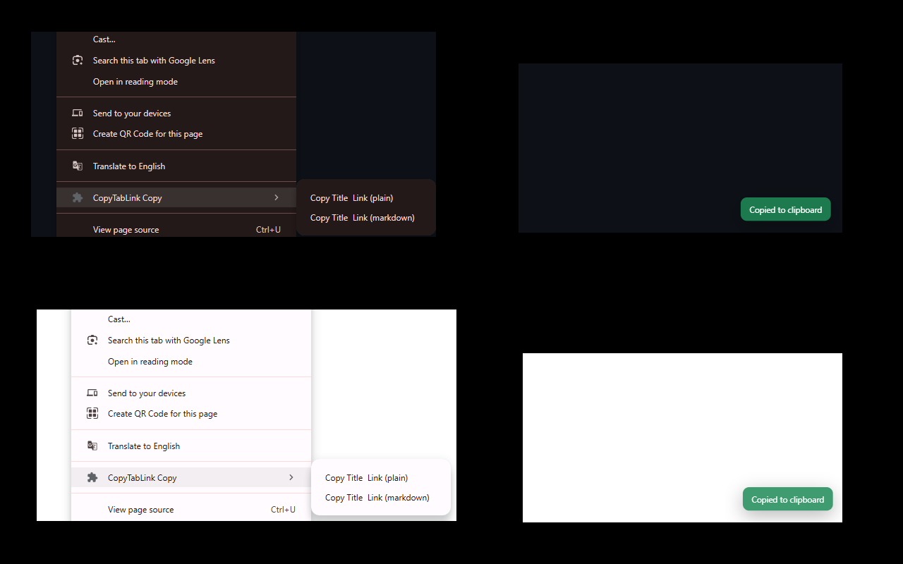

[](https://github.com/guitarrapc/CopyTabLink/actions/workflows/build.yml)

# CopyTabLink

Chrome extension that copies the current page title and URL.

You can copy by Shortcut or context menu. Toaast notification will be shown after copying.



Load `dist/` from `chrome://extensions/` with Developer Mode enabled.

## Commands

| WHAT | Windows/Linux | macOS |
| --- | --- | --- |
| Copy plain format | `Alt+C` | `Option+C` |
| Copy markdown format | `Alt+M` | `Option+M` |

## Development

```bash
npm install
npm run build
```

Scripts

- `npm run build`: build and output to `dist/`
- `npm run clean`: remove `dist/`
- `npm run resize:logo`: resize logo to 128x128
- `npm run bump:version`: bump version in `package.json` and `manifest.json`
- `npm run verify:release-version`: verify version in `package.json` and `manifest.json` are the same to git tag
- `npm run lint`: run linting
- `npm run typecheck`: run type checking
- `npm run test`: run all tests
- `npm run test:unit`: run unit tests
- `npm run test:e2e`: run end-to-end tests
